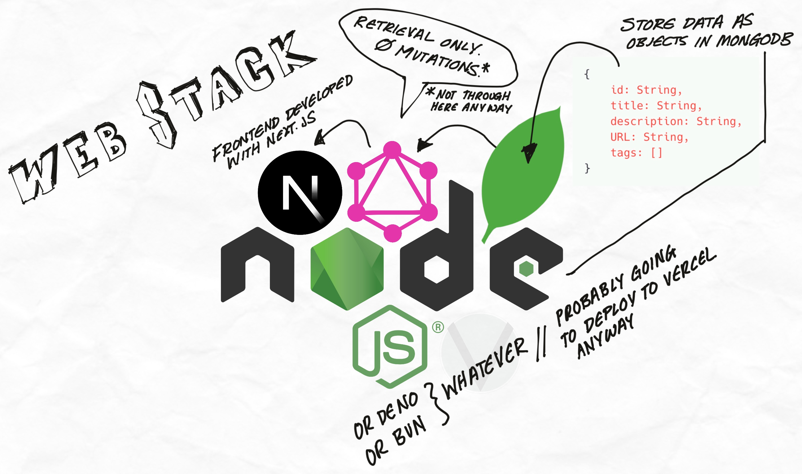

<h1 align="center">The Design Compendium</h1>

<p align="center">
    <br>
    
    <br>
    <br>
    <i>A repository of resources of all types to improve
        <br> the visual representation of your projects.
    </i>
    <br>
</p>

<p align="center">
    <a href="https://blog.ephemeralrogue.xyz/the-design-compendium">
        Project Writeup,
    </a> by
    <a href="https:////github.com/ephemeralrogue">
        ephemeralrogue
    </a>
    •
    <a href="https://bsky.app/profile/lvnacy.xyz">
        Bluesky
    </a>
    <br>
</p>

<a id="overview"></a>
<h2 align="center">Overview</h2>

There are innumerable design resources out there, and almost as many 
repositories ennumerating them. The Design Compendium will take the classic 
README-style resource list and provide a frontend for the quick perusal of 
resources by category.

This project is currently designed to be forked and utilized on a personal 
basis, as deployment of the official frontend will not occur until funding 
makes deployment plausible. you can read about it 
[here](https://blog.ephemeralrogue.xyz/the-design-compendium).

This is being produced and maintained by 
[ephemeralrogue](https://github.com/ephemeralrogue) 
for LVNACY. Any questions regarding this repository and any contributions 
should be directed there.
[ephemeralrogue's Discord Server](https://discord.gg/nh7mqGEfbw)

<a id="contents"></a>
<h2 align="center">Contents</h2>

- [Overview](#overview)
- [The Goal](#goal)
- [The Stack](#stack)
- [TODO](#todo)
- [Contributing](#contributing)

<a id="goal"></a>
<h2 align="center">The Goal</h2>

A Single Page Application (SPA) with client-side rendering of two components:
1. tag cloud where each tag is a link that will render the content
2. component displaying the tagged resources

[back to Contents](#contents)

<a id="stack"></a>
<h2 align="center">The Stack</h2>
Here is the full stack concept of the project:
<div>
    
</div>

[back to Contents](#contents)

<a id="todo"></a>
<h2 align="center">TODO</h2>

- add MongoDB connection
- build GraphQL resolvers to retrieve data
- write algorithm to display resources by tag
- make the frontend pretty

[back to Contents](#contents)

<a id="contributing"></a>
<h2 align="center">Contributing</h2>
with regard to the general development of what currently exists here:


This is a [Next.js](https://nextjs.org) project bootstrapped with [`create-next-app`](https://nextjs.org/docs/app/api-reference/cli/create-next-app).

First, run the development server:

```bash
npm run dev
# or
yarn dev
# or
pnpm dev
# or
bun dev
```

Open [http://localhost:3000](http://localhost:3000) with your browser to see the result.

You can start editing the page by modifying `app/page.tsx`. The page auto-updates as you edit the file.

This project uses [`next/font`](https://nextjs.org/docs/app/building-your-application/optimizing/fonts) to automatically optimize and load [Geist](https://vercel.com/font), a new font family for Vercel.

## Learn More

To learn more about Next.js, take a look at the following resources:

- [Next.js Documentation](https://nextjs.org/docs) - learn about Next.js features and API.
- [Learn Next.js](https://nextjs.org/learn) - an interactive Next.js tutorial.

You can check out [the Next.js GitHub repository](https://github.com/vercel/next.js) - your feedback and contributions are welcome!

## Deploy on Vercel

The easiest way to deploy your Next.js app is to use the [Vercel Platform](https://vercel.com/new?utm_medium=default-template&filter=next.js&utm_source=create-next-app&utm_campaign=create-next-app-readme) from the creators of Next.js.

Check out our [Next.js deployment documentation](https://nextjs.org/docs/app/building-your-application/deploying) for more details.

[back to Contents](#contents)